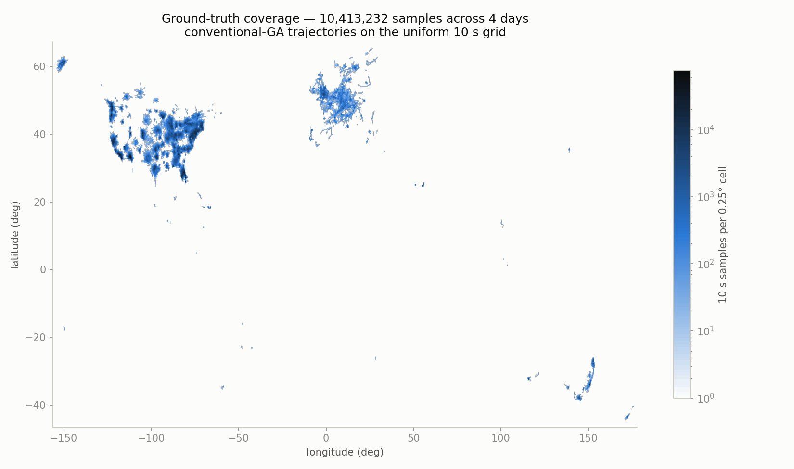
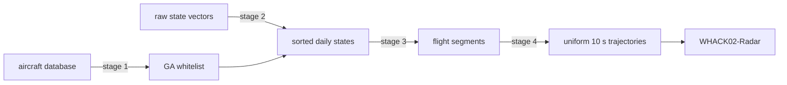
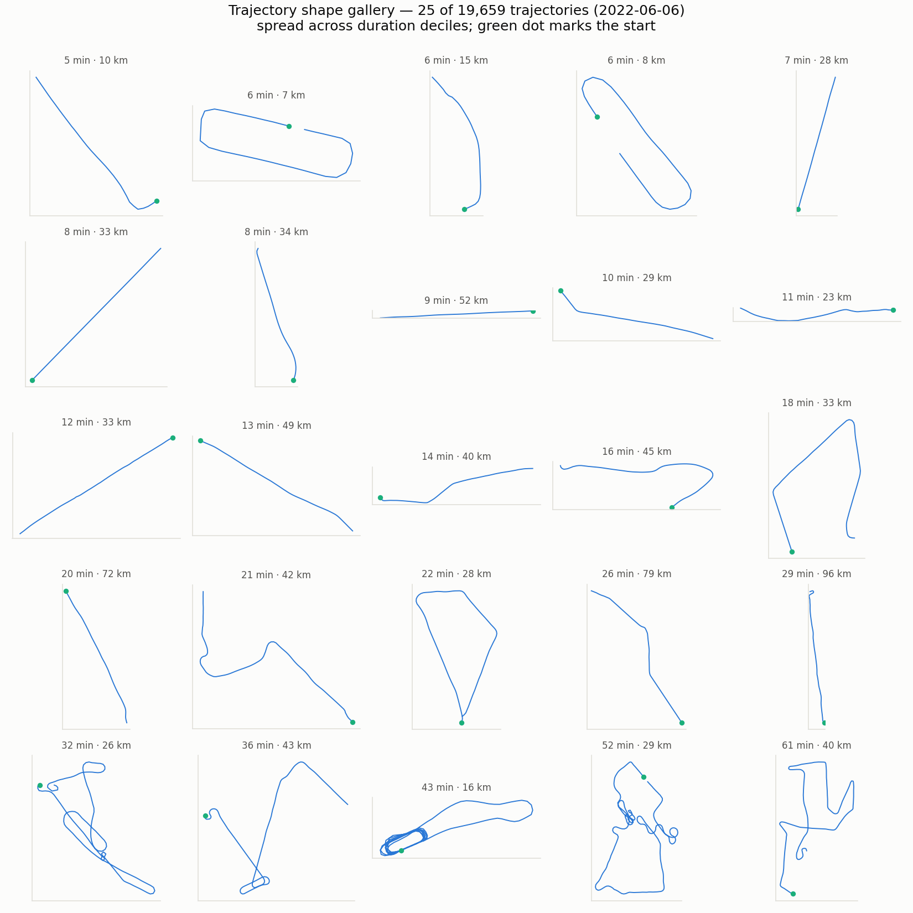
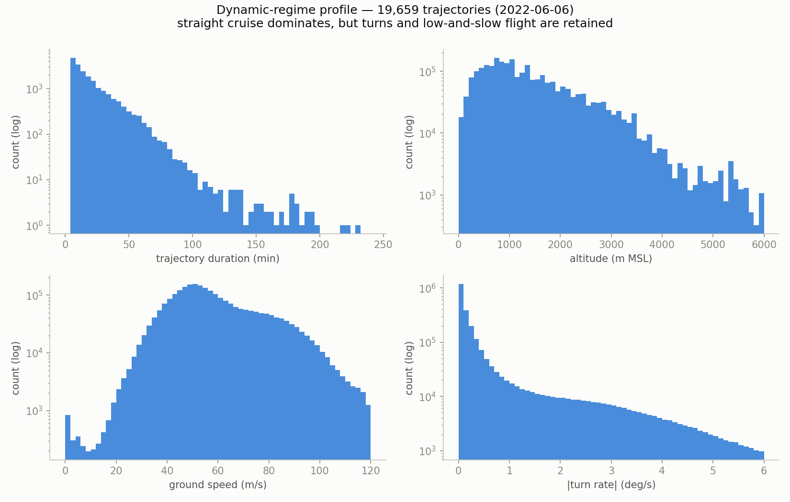
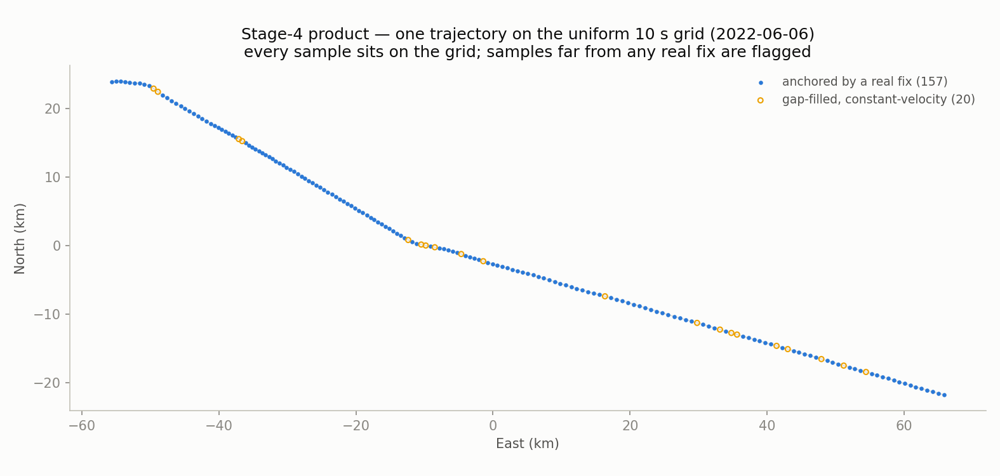

# WHACK01-Preprocessing

### OpenSky ADS-B → clean, uniformly-sampled general-aviation ground-truth trajectories

*4 survey days · ~460k aircraft screened · streamed 41 GB · Python (numpy · pandas · matplotlib)*

Stages 1–4 of the WHACK pipeline: raw [OpenSky](https://opensky-network.org/) aircraft-database and state-vector CSVs become per-day trajectory files on a uniform 10 s grid — the ground truth that [WHACK02-Radar](https://github.com/zheniannn/WHACK02-Radar) turns into simulated radar measurements for target-vs-clutter discrimination research.



> **At a glance** — the funnel across the four survey days (2022-06-06 / 13 / 20 / 27):
>
> **460,000** aircraft screened → **164,592** GA whitelist → **19.0 M** filtered state rows → **79,743** flight segments → **82,538** uniform-grid trajectories (**10.4 M** samples). Every stage self-validates and raises on failure; maneuvers are flagged, never dropped.

## Pipeline



| Stage | Script | What it does |
|---|---|---|
| 1 | `01_preprocessing.py` | Filters the aircraft database to a **conventional-GA whitelist** (light fixed-wing piston; excludes jets, turboprops, helicopters, ag/military variants) |
| 2 | `02_state_filtering.py` | Keeps only whitelisted aircraft in the raw state vectors; concatenates and sorts **one file per day** |
| 3 | `03_trajectory_prep.py` | Cleans (staleness, coordinates, on-ground, altitude) and splits each aircraft's day into **flight segments**; removes GPS glitches |
| 4 | `04_resample_trajectories.py` | Interpolates each segment onto a **uniform 10 s grid** with derived motion (speed, accel, turn rate) and gap-fill flags |
| — | `make_figures.py` | Renders the report figures shown in this README |

Full stage-by-stage rules, CLI flags, and method rationale: **[docs/PIPELINE.md](docs/PIPELINE.md)**.

## Quickstart

Python ≥ 3.9 with `numpy`, `pandas`, `matplotlib`:

```bash
pip install -r requirements.txt
```

Data lives outside the repo (default `data/` beside it; override with `WHACK_DATA_ROOT`):

```
<data root>/
├── archive/                        # raw OpenSky inputs, never modified
├── active/                         # everything the pipeline writes
│   ├── states/                     # stage 2 output
│   ├── segments/                   # stage 3 output
│   └── trajectories_10s/           # stage 4 output (dir name follows --dt)
└── plot/WHACK01-Preprocessing/     # report figures
```

Run the stages in order (any working directory; paths resolve from the repo):

```bash
python scripts/01_preprocessing.py
python scripts/02_state_filtering.py
python scripts/03_trajectory_prep.py
python scripts/04_resample_trajectories.py
python scripts/make_figures.py          # optional: report figures
```

Every stage prints per-day statistics and ends with a **validation gate** — hard checks (uniform grid spacing, threshold compliance, a cruise-speed sanity anchor, a working on-ground filter) that raise on failure rather than letting a silently-broken product flow downstream.

## What the output looks like

The whitelist captures the full variety of GA flying — straight cross-country transits, training circuits, aerial-survey mowing patterns:



The retained dynamic regimes — deliberately including turns and slow flight (see *Design decisions*):



Stage 4's product: every sample sits exactly on the 10 s grid; samples more than dt/2 from any real fix are flagged `is_interpolated` so downstream analyses can exclude synthetic (constant-velocity) points:



## Key columns (stage-4 output)

| Column | Meaning |
|---|---|
| `trajectory_id` | Globally unique: `{icao24}_{segment_start_epoch}_r{k}` |
| `timestamp`, `dt_s` | Uniform grid (epoch seconds, 10 s spacing) |
| `lat/lon/alt_interp` | Linearly interpolated position (WGS-84 deg, m MSL) |
| `is_interpolated` | True where no real fix lies within dt/2 (gap-filled, constant-velocity) |
| `speed_mps`, `accel_mps2`, `turn_rate_deg_s` | Grid-derived motion (backward differences) |
| `raw_*_max_*`, `n_raw_fixes` | Native-rate dynamics from the raw fixes per grid interval — the truth for maneuver intensity (grid differences are low-passed) |
| `exceeds_accel_limit`, `exceeds_turn_rate_limit` | Dynamics flags (flagged, **not** dropped) |

## Design decisions

- **Maneuvers are flagged, never dropped.** Dropping high-accel/turn-rate flights would bias the dataset toward benign, steady flight — exactly the wrong prior for discriminating real maneuvering targets from clutter. Hard drops are reserved for unusable data (too short, too sparse, > 300 kt glitches).
- **Position time, not snapshot time.** Stages 3–4 index every row by `lastposupdate` (when the position was measured); a freshness filter drops rows whose position is > 10 s stale.
- **GPS glitches are removed point-wise, not split-wise.** A single corrupt point shows up as two implausible-speed steps; removing the most-implicated point (up to 3 passes) fixes both without shredding the flight. Segments still violating on > 5 % of steps afterwards are discarded whole.
- **Interpolation never spans a gap > 30 s** — the segment is split instead, and gap-filled samples are flagged.
- **Resample from the segments, not from a grid.** Need a different scan period? `--dt 4` re-runs stage 4 from stage 3's output; re-interpolating an existing grid would compound the low-pass smoothing.
- **Everything is auditable.** Cross-day summary CSVs per stage; every dropped trajectory is recorded with its reason in `trajectory_resample_dropped.csv`.

## Caveats

- Days are cut at 00:00 UTC by file, so a flight crossing midnight appears as two independent trajectories.
- Only `callsign` is carried from the state vectors; aircraft-database metadata (type, manufacturer) stays in the whitelist file, joinable on `icao24`.
- OpenSky's `heading` is track-over-ground; the derived motion follows the same convention.

## Repository layout

```
scripts/            one entry point per stage + make_figures.py
utils/
├── common.py                 constants/helpers shared across stages
├── io.py                     all filesystem paths (single source of truth)
├── ga_classification.py      stage 1 rules: what counts as conventional GA
├── state_filtering.py        stage 2 rules
├── trajectory_prep.py        stage 3 rules
└── resample_trajectories.py  stage 4 rules
docs/
├── PIPELINE.md               full stage-by-stage reference
└── figures/                  README images (regenerate with make_figures.py)
```
